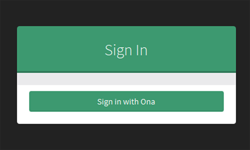
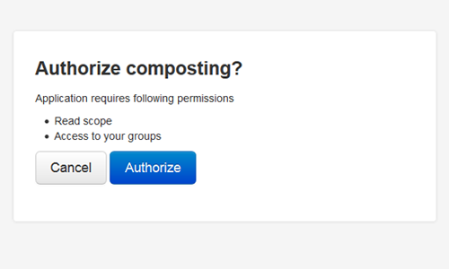

.. _accessing_the_dashboard:

***********************
Accessing the dashboard
***********************

The dashboard is accessible at `http://compost.ona.io <http://compost.ona.io>`_

.. _register_for_an_ona_account:

Register for an Ona account
===========================

You will require an **ona.io** account to access the dashboard. If you don't
already have one, click here to `register <https://ona.io/accounts/register/>`_.

.. _logging_in:

Logging in to the dashboard
===========================

When you open the dashboard on your browser, you will be required to login to
access it. You will be presented with the screen below.

    ``NOTE: You will require an ona.io user account to proceed, if you
    don't already have an account register for one.``

Click on the button labelled **Sign in with Ona** to proceed.

If you are not logged in yet, login to proceed.

You will be presented with the screen below.

Click on **Authorize** to proceed.

If this is your first time accessing the dashboard, you may be presented with
the message ``Your account has been created, please contact your administrator
to activate it.`` If so, you will need to contact your administrator and ask
them to activate your account.
