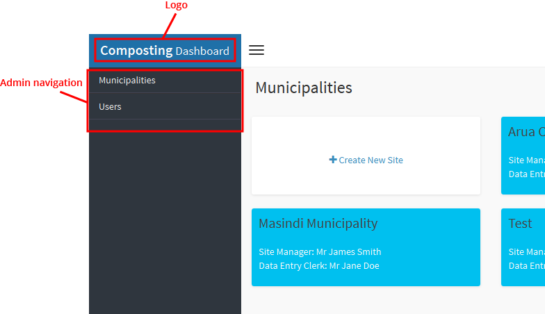
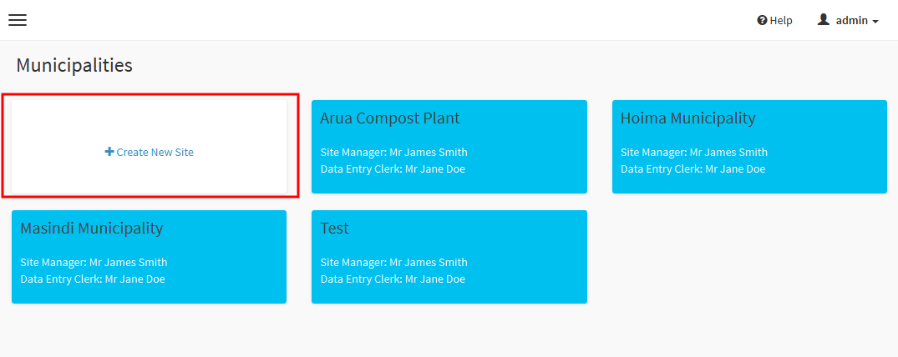
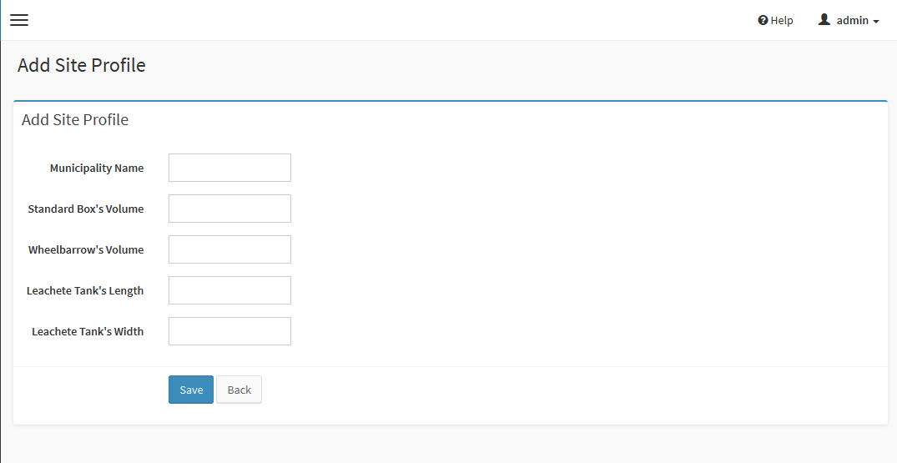
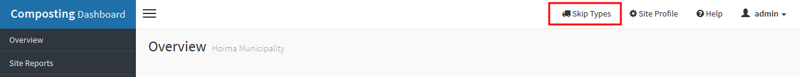
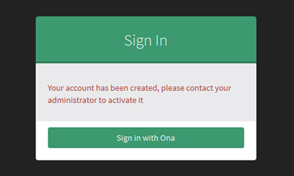
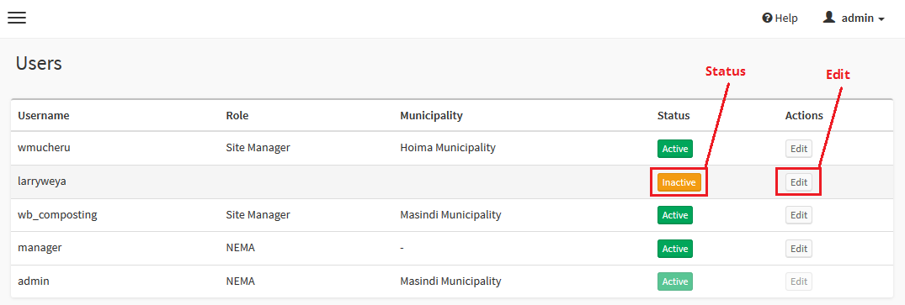
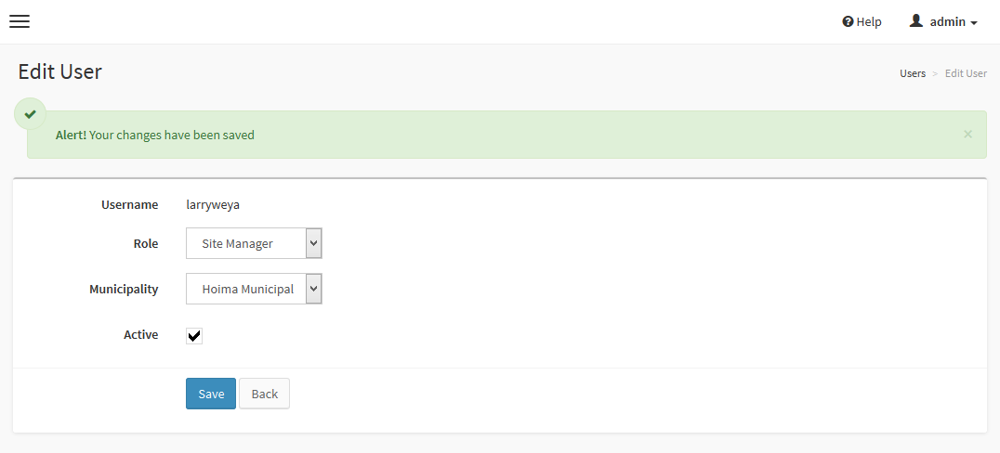
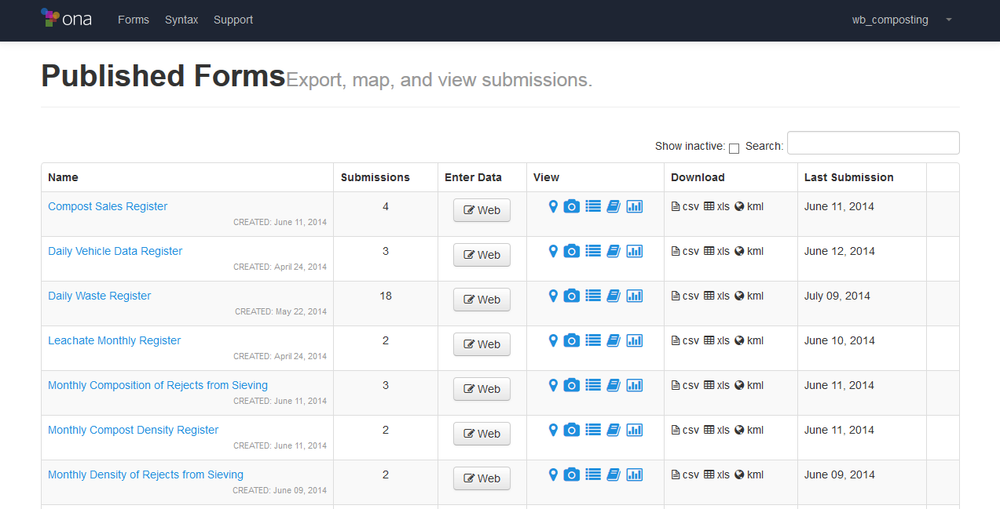
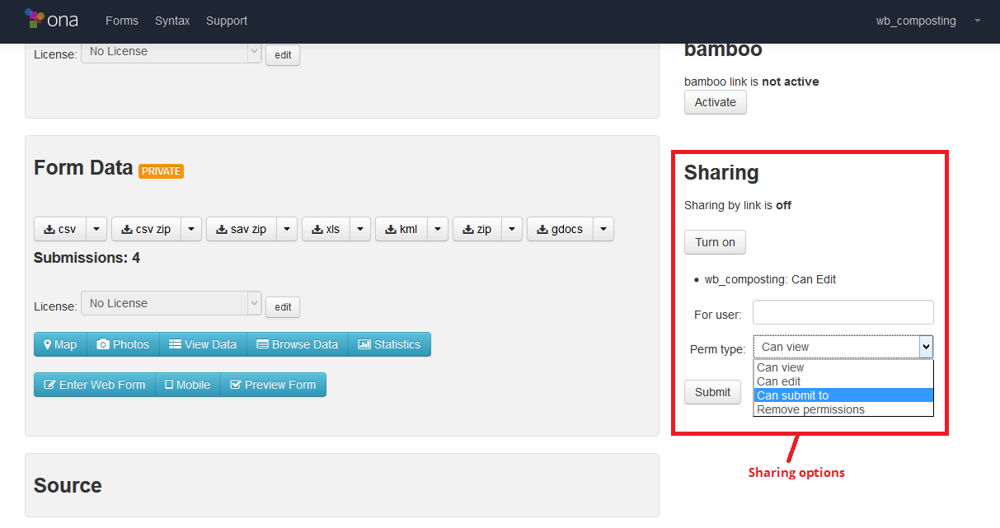

.. _admin_user_interface:

*****************************
Administrative user interface
*****************************

``NOTE: This sections is only accessible to NEMA and World Bank users``

When you first login, you will be presented with a list of existing
municipalities, if any.

Municipalities
==============

.. _creating_a_municipality:

Creating a Municipality
-----------------------

``NOTE: To create a municipality, you must be in the municipalities list
screen. If you are not on this screen, click on the site logo, at the top left
hand side of the screen, then click on municipalities on the menu of the left
hand side.``

Click on the box labelled **Create New Site**.

On the resulting screen, provide the details as follows.

    * **Municipality Name** - The name of the municipality.
    * **Standard Box's Volume** *(default 0.125m3)* - The volume of the box
      used to contain compost when determining the compost density.
    * **Wheelbarrow's Volume** (default 0.625m3) - The volume of the
      wheelbarrow used to transport waste for land-filling.
    * **Leachete Tank's Length** -  Length of the leachate tank in meters
    * **Leachete Tank's Width** -  Width/Breadth of the leachate tank in meters

Click on **Save** to create the new municipality. You will be redirected to
the municipality's profile page. You may make any changes to the properties as
you wish and click on **Save** again to save them.

Editing a Municipality's Profile
--------------------------------

To update a municipality's profile, click on the municipality from the
municipalities list screen. Once its loaded, click on **Site Profile** on the
top-right of the screen.

On the resulting screen, update the values as required to save the changes.

Configuring a Municipality's Skips
----------------------------------

Each municipality can configure the dimensions of any of its skips.
A municipality can have a total of 26 skips, one for each of the letters A-Z.

Creating a new skip
~~~~~~~~~~~~~~~~~~~

To create a new skip, click on **Skip Types** on the top bar. ``NOTE:
you must be within municipality to get the Skip Types menu``

Within the **Skip Types** screen, click on the button labelled
**New Skip Type.** From here, you will need to specify the skip's attributes
as follows:

    * **Skip Type** - This must be an uppercase letter between A-Z and must
      not already exist in the list of skip types.
    * **Small Length** - The length of the bottom part of the skip.
    * **Large Length** - The length of the top part of the skip.
    * **Small Breadth** - The width/breadth of the bottom part of the skip.
    * **Large Breadth** - The width/breadth of the top part of the skip.

Click **Create** to save it. Once its is saved, you will get an alert that it
has been created. Click on **Skip Types** to go back to the list of skips. You
should see the skip you just created in the list.

Editing a skip
~~~~~~~~~~~~~~

``NOTE: editing a skips dimensions will have an effect on volume calculations on
daily waste submissions that have that particular skip type and that have not
yet been approved.``

To edit a sip, click on **Skip Types** on the top bar. ``NOTE: you must be
within municipality to get the Skip Types menu``

From the list of skips, click on the **Edit** of the skip you would like to edit.

Update the skip's values as required and click save to save your changes.

Deleting a skip
~~~~~~~~~~~~~~~

``NOTE: deleting a skip will have an effect on volume calculations on
daily waste submissions that have that particular skip type and that have not
yet been approved.``

To delete a skip, click on **Skip Types** from the top bar. ``NOTE: you must be
within municipality to get the Skip Types menu``

Click on the button labelled **Delete** and click on **Delete** to confirm
that you would like to delete the skip.

Users
=====

Activating users
----------------

For a user to gain access to the dashboard, they must first have an
`ona.io <https://ona.io>`_.

Once a user has registered for an **ona.io** account, ask them to login to the
dashboard at `<http://compost.ona.io/auth/sign-in>`_. Once they authorize
access as detailed in :ref:`logging_in`, they will get the following message

At this point, you will need to activate their account to allow them access.
To do this click on the **Users** menu item within the left navigation.
``NOTE: You must be within the admin section and NOT within a municipality
to get the Users menu. If you are not within the admin section, click on the
logo labelled Composting Dashboard on the top left, then click on Users``

Find the user in the list, their status column should be labelled **Inactive**.

Click on the edit button to update their details as follows.

    * **Role** - If the user is from NEMA or The World Bank, set their role to
      either NEMA or World Bank to allow them admin access. If the user
      belongs to certain municipality, set their role to either
      **Site Manager**, **Environmental Officer** or **Data Entry Clerk**
      as appropriate. In this case, you must also specify which municipality
      they belong to.
      ``NOTE: if the municipality is not in the list, refer to``
      :ref:`creating_a_municipality`

    * **Municipality** - The municipality they belong to, *only if they are
      either a Site Manager or an Environmental Officer.* Otherwise, leave it
      blank.

    * **Active** - Whether or not they are allowed to login. When a user
      first registers, they are Inactive, make them active to allow them access.

Allowing data entry clerks to make submissions
----------------------------------------------

It is very important to assign data entry clerks to their municipalities as it
is what will allow their submissions to be mapped to their municipalities.
You may leave their account as inactive if they do not need to login to the
dashboard.

Once the data entry clerk has been assigned to a municipality, a final step
must be completed to allow them to make submissions to the dashboard.
This is done within the **wb_composting** account on `<https://ona.io>`_.

Login with the **wb_composting** credentials on `<https://ona.io>`_. Click on
the first form in the list of forms to open it.

Within the sharing section, under **For user** start typing in the username
of the data entry clerk and select it from the list that is displayed. Then
under **Perm type**, select **Can submit to**

Repeat the same for all the forms.
