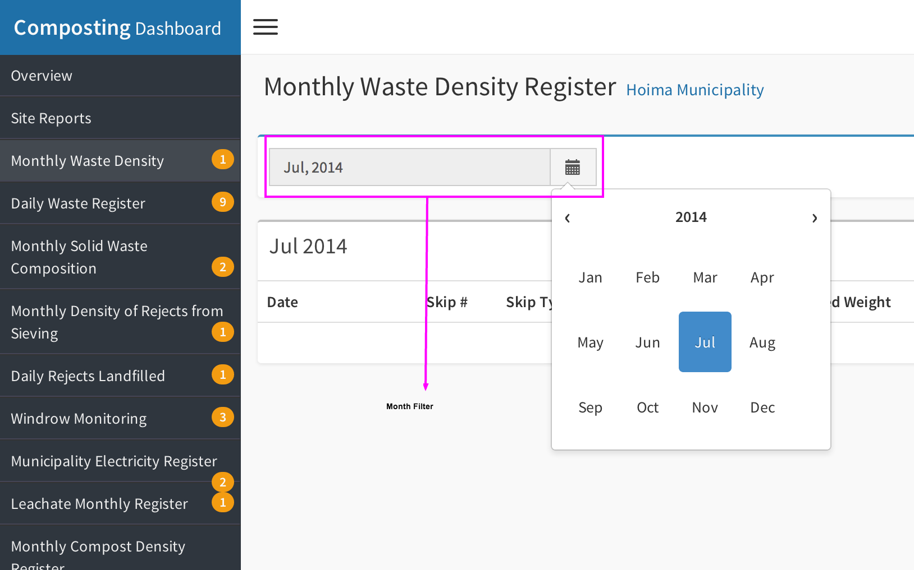
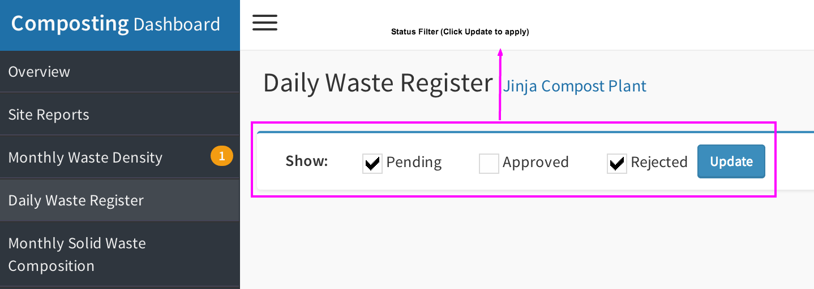
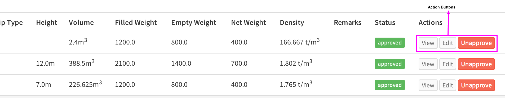
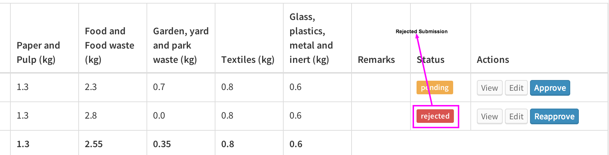

.. _general_municipality_ui:

**************************************
General interaction with the registers
**************************************

When you first login, you will be presented with the municipality's overview
screen.

    ``NOTE: This is blank at the moment and will be enhanced at a later date to
    display trends and snapshot data for the municipality.``

You can access the various registers using the menu on the left hand side of
the screen.

To access any of the registers, click on the name of the register on the left
navigation.

    ``NOTE: The list will only show up on the left navigation when you
    are within a municipality``

Each of the registers follows a similar convention allows the following actions.

Filtering
=========

When you first load any register, the data available within that register will
be displayed within the content area. At the very top of the content area, you
will find a filter section that will allow you to specify a search criteria.

There are 2 kinds of filters, depending on the type of register. One for registers
that capture dat once every month e.g. The **Monthly Waste Density Register** and
another for registers that capture could capture data multiple times ina  month
e.g. **The Daily Waste Register**.

``NOTE: some registers may be labelled as monthly but actually capture data
multiple times in a given month, these will have a status filter instead
e.g. The Leachate Monthly Register``

Filter by month
---------------

This filter allows you to specify a month of interest and view data for
that particular month.

Filter by status
----------------

Registers that contain this filter will, by default, only display
**un-approved** records. The filter can be used to display all the data -
including **approved** records within the register.

Managing Records
================

Right below the filter, you will find the list of records for the particular
register you have accessed. With each record, the following actions can be
performed.

View the entire record
----------------------

Each record within the list only displays a subset of the data to maximise the
space available.

On any record, in the column labelled **Actions**, click on the button
labelled **View**, this will pop-up a box with all the data for that particular
record. This is a good way to examine the data closely if something seems
incorrect form within the list.

Edit the record
---------------

Any of the records can be edited if the data requires correction. To edit the
record, click on the button labelled edit. You will be redirected to the edit
page. ``NOTE: you may be required to login, please login using your ona.io
account username and password to proceed``

    ``NOTE: An error may be displayed the first time you login to edit a record,
    in-case this happens, go back to the dashboard and click on edit once again.``

Approve a record
----------------

Once you are satisfied with the data contained within a record, you should
approve it to have it used within the reports. To approve a record, simply
click on the button labelled **Approve**

    ``NOTE: in some cases, the Approve button may not be available, in these cases,
    you will notice a red exclamation mark in one or more od the record's fields.
    Place your mouse on the exclamation mark to get a message that explains why the
    record cannot be approved. This usually happens when a calculation on the
    record relies on a calculation ina different register.``

Reject a record
---------------

A record maybe rejected by either the environmental officer or by NEMA after
it has been approved. This is useful when a record has some irregularity and
will guarantee that the record's data will not be used within the reports until
it is re-approved.

