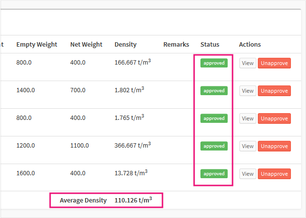
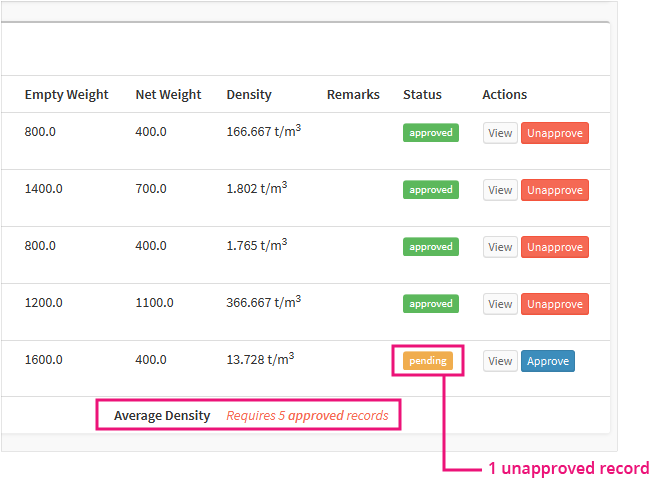

.. _register_monthly_waste_density:

******************************
Monthly Waste Density Register
******************************

Every month, 5 skips are chosen at random and their data used to determine the
average waste density for the month. For each record/truck, the net weight is
calculated from the difference between the filled and empty weights.

The density for each record is then determined from the volume and the net
weight.

An month's average density is then is calculated from 5 **approved** records.

``NOTE: the monthly waste density cannot be determined if the number of
approved records are not 5 or more``

