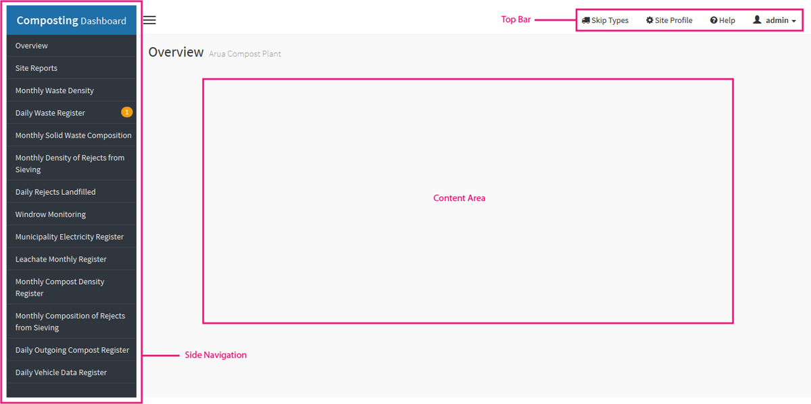

.. _using_the_dashboard:

*************************
Overview of the interface
*************************

The top bar
===========

This is the top right hand side of the dashboard. It contains these sections.

* **Sign-out link** - The button at the extreme right will contain your
  username. To sign-out, click on your username and click on Sign Out.
* **Help** - A link to this documentation
* **Site Profile** - Allows you to update the sites details i.e. the name,
  the dimensions of the compost box and wheelbarrow and the dimensions of the
  site's leachate tank.
* **Skip Types** - Allows you to manage the different skips that exist within
  the municipality and their dimensions.

The side navigation
===================

This is the section on the left side of the screen. It will contain links that
will load content in the content area.

The content area
================

The content area will display data for whichever section you are currently on
